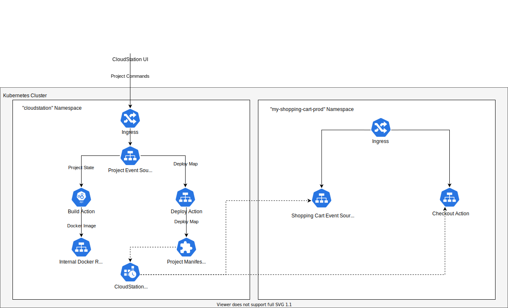

# CloudStation
An unofficial IDE for CloudState.  Develop and deploy Event Sourced Entities, Replicated Entities, and Actions.  Focus on business logic instead of operations.

This project is a very early work-in-progress.  Contributions and ideas are welcome and appreciated.

## Screenshots

## Developer Setup
1. Install Flutter.
   - [Flutter Install]([Instructions](https://flutter.dev/docs/get-started/install))
   - Run `flutter channel dev`
   - Run `flutter upgrade`
   - Run `flutter config --enable-linux-desktop`
2. Install Dart protoc plugin
    - `pub global activate protoc_plugin`
3. Generate Dart protos.
   - `cd protocols_dart`
   - `flutter pub get`
   - `./generate_protos.sh`
   - `cd ..`
4. Run Frontend
    - `cd frontend`
    - `flutter pub get`
    - `flutter run`

## System Overview
